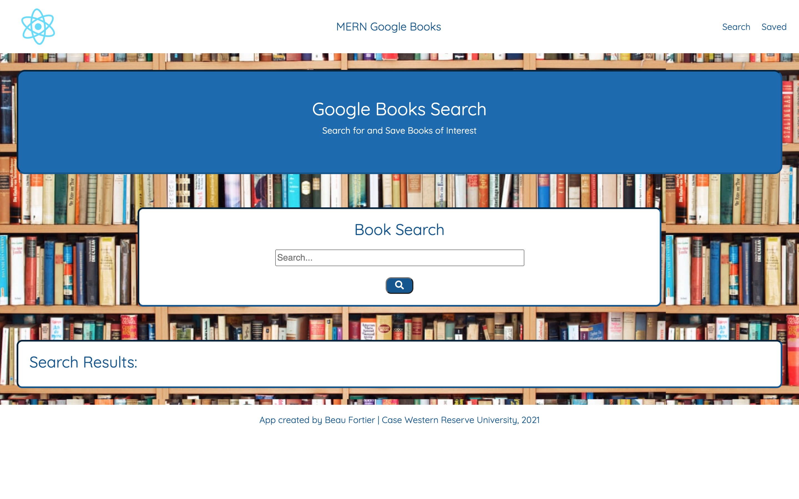
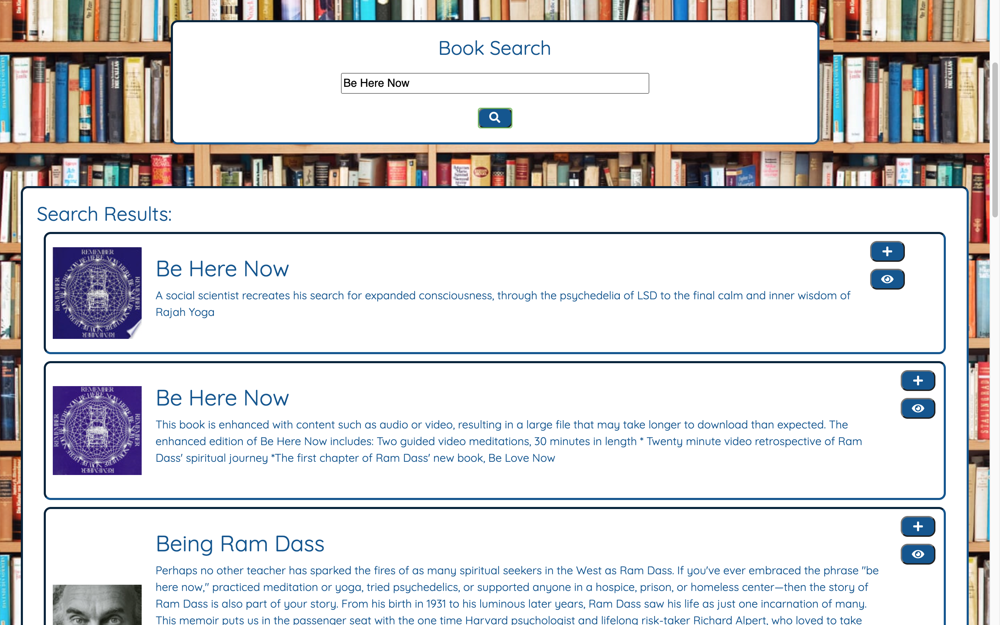
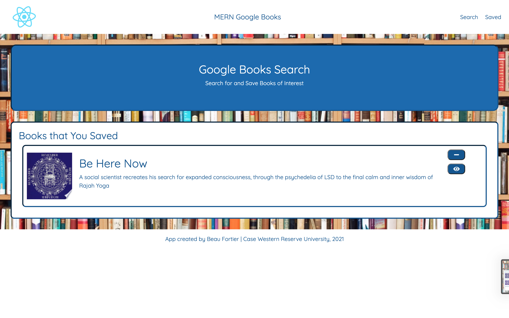

 # MERN GoogleBooks
  
  ## License
  

  ## Description
  This application lets the user search for their favorite books and save them to a database to create a list.

  ## Table of Contents
  - [Description](#description)
  - [Installation](#installation)
  - [Usage](#usage)
  - [License](#license)
  - [Contributing](#contributing)
  - [Tests](#tests)
  - [Questions](#questions)

  ## Installation
  npm install

  ## Usage
  Type the name of the book you want to search, click the plus sign to save the book or click the eye to view the book details and information on where to buy. Click saved to see the saved books and click the minus to delete a book from your list.

  ## License
  MIT
  
  ## Contributing
  Beau Fortier

  ## Tests
  no tests were involved

  ## Questions
  email me for any questions
  
  GitHub: [beau4ta](https://github.com/beau4ta)
  
  Email me with any questions: beaufortier13@gmail.com

  Link to the repository: https://github.com/beau4ta/MERN-GoogleBooks
  
Link to the deployed application: https://immense-bastion-60160.herokuapp.com/

Screenshots:

